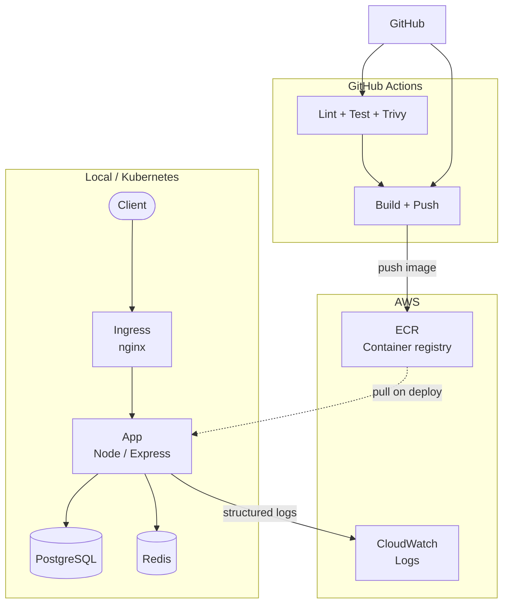
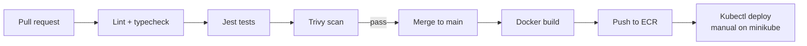

# URL Shortener

A production-shaped URL shortener built as a DevOps learning project. You get a Node/Express API with PostgreSQL persistence and Redis caching, containerised with Docker, runnable on Kubernetes, and shipped through GitHub Actions to AWS ECR with Terraform-managed infrastructure and CloudWatch logging.

## What it is

This is a small URL shortener API (`POST /shorten`, `GET /:code`, `GET /health`) that I built to practise the full delivery path: write the app, test it, containerise it, run it on Kubernetes, and automate builds with CI/CD. The scope is deliberately modest so the focus stays on infrastructure, observability, and deployment rather than feature breadth.

## Architecture



Traffic hits the app through Ingress on Kubernetes (or port 3000 via Docker Compose locally). Postgres stores URL mappings. Redis caches redirect lookups and backs rate limiting. GitHub Actions runs tests on every PR, scans the image with Trivy, and pushes to ECR on merge to `main`. Container logs ship to CloudWatch when AWS credentials are configured.

## Tech stack

| Layer | Technology | Purpose |
|-------|------------|---------|
| API | Node 20, Express, TypeScript | HTTP server and business logic |
| ORM | Prisma | Schema, migrations, and database access |
| Database | PostgreSQL 15 | Persistent storage for short codes |
| Cache | Redis 7 | Cache-aside on redirects, rate-limit store |
| Validation | Zod | Request validation and SSRF checks |
| IDs | nanoid | URL-safe 7-character short codes |
| Logging | pino | Structured JSON logs |
| Metrics | prom-client | Prometheus `/metrics` endpoint |
| Containers | Docker, docker-compose | Local multi-service stack |
| Orchestration | Kubernetes (minikube) | Deployments, Services, Ingress, HPA |
| IaC | Terraform 1.7+ | ECR, IAM, CloudWatch log group |
| Registry | AWS ECR | Image storage for CI/CD |
| Observability | AWS CloudWatch Logs | Centralised log destination |
| CI/CD | GitHub Actions | Lint, test, scan, build, push |
| Security | Trivy | Container vulnerability scanning |

## Prerequisites

- [Docker](https://docs.docker.com/get-docker/) (Docker Desktop or Engine)
- [Docker Compose](https://docs.docker.com/compose/) v2 (`docker compose`)
- `curl` or similar HTTP client

Optional, for Kubernetes and AWS sections:

- [minikube](https://minikube.sigs.k8s.io/docs/start/) and [kubectl](https://kubernetes.io/docs/tasks/tools/)
- [Terraform](https://developer.hashicorp.com/terraform/install) 1.7+
- AWS account with credentials configured (`aws configure`)

## Local development

### 1. Clone and configure

```bash
git clone https://github.com/ATedy/url-shortener.git
cd url-shortener
cp .env.example .env
```

Edit `.env` if you need to change defaults. The compose file reads from it.

### 2. Start the stack

```bash
docker compose up --build
```

Wait until all three services report healthy. The app listens on port 3000.

### 3. Verify endpoints

Health check:

```bash
curl -s http://localhost:3000/health | jq
```

Expected shape:

```json
{
  "status": "ok",
  "db": "up",
  "redis": "up",
  "uptime": 42.5
}
```

Create a short URL:

```bash
curl -s -X POST http://localhost:3000/shorten \
  -H "Content-Type: application/json" \
  -d '{"url": "https://example.com"}' | jq
```

Follow the redirect (replace `abc1234` with the code from the response):

```bash
curl -sI http://localhost:3000/abc1234
```

You should see `HTTP/1.1 302` with a `Location` header pointing at the original URL.

### 4. Run tests (without compose)

If you prefer running the app directly against local services:

```bash
npm ci
npm test
```

Integration tests require Docker running (Testcontainers spins up Postgres).

### 5. Stop

```bash
docker compose down
```

Postgres data persists in a named volume across restarts. Add `-v` to remove it.

## Kubernetes deployment

Manifests live in `k8s/`. They target minikube locally but are written to be EKS-compatible (see comments in each file).

### Cluster setup

```bash
minikube start --cpus=4 --memory=6g --driver=docker
minikube addons enable ingress
minikube addons enable metrics-server
eval $(minikube docker-env)
docker build -t url-shortener:local .
```

### Prepare secrets

```bash
cp k8s/secret.example.yaml k8s/secret.yaml
# Edit k8s/secret.yaml with a real base64-encoded POSTGRES_PASSWORD
```

Add the ingress host to your hosts file:

```bash
echo "$(minikube ip) url-shortener.local" | sudo tee -a /etc/hosts
```

On Windows, add the same mapping to `C:\Windows\System32\drivers\etc\hosts`.

### Apply order

Apply manifests in dependency order. Config and storage first, then data services, then the app, then routing and autoscaling.

```bash
kubectl apply -f k8s/db-pvc.yaml
kubectl apply -f k8s/configmap.yaml
kubectl apply -f k8s/secret.yaml
kubectl apply -f k8s/db-deployment.yaml
kubectl apply -f k8s/redis-deployment.yaml
kubectl apply -f k8s/db-service.yaml
kubectl apply -f k8s/redis-service.yaml
kubectl apply -f k8s/app-service.yaml
kubectl apply -f k8s/app-deployment.yaml
kubectl apply -f k8s/ingress.yaml
kubectl apply -f k8s/hpa.yaml
```

Once everything is ready:

```bash
kubectl get pods
kubectl get hpa
curl http://url-shortener.local/health
```

### Deploying an updated image

**minikube (local):** rebuild inside the minikube Docker daemon and restart:

```bash
eval $(minikube docker-env)
docker build -t url-shortener:local .
kubectl rollout restart deployment/app
```

**ECR / EKS (production path):** after CI pushes a new image:

```bash
aws eks update-kubeconfig --name <cluster-name> --region <aws-region>
kubectl set image deployment/app app=<ecr-repository-uri>:<commit-sha>
kubectl rollout status deployment/app
```

The app Deployment uses `maxUnavailable: 0` and `maxSurge: 1`, so rollouts replace pods one at a time with no downtime.

## CI/CD pipeline



### On every pull request

Workflow: `.github/workflows/ci.yml`

1. Checkout code
2. Install Node 20 dependencies (`npm ci`)
3. Run ESLint (`npm run lint`)
4. Run TypeScript check (`npm run typecheck`)
5. Run Jest (`npm test`)
6. Build the Docker image
7. Scan with Trivy (fails on HIGH or CRITICAL CVEs)
8. Upload SARIF results to the GitHub Security tab

### On merge to main

Workflow: `.github/workflows/deploy.yml`

1. Checkout code
2. Authenticate to AWS with repository secrets
3. Log in to ECR
4. Build and tag the image with the commit SHA and `latest`
5. Push both tags to ECR

Deploy to the cluster is manual on minikube. On EKS, add a `kubectl set image` step after `aws eks update-kubeconfig` (see commented example in `deploy.yml`).

## AWS setup

Terraform provisions the AWS resources this project needs. State is stored locally for learning; use an S3 backend with DynamoDB locking for anything shared or production.

### Provision infrastructure

```bash
cd terraform
terraform init
terraform plan
terraform apply
```

This creates:

- ECR repository `url-shortener` (image scanning on push)
- IAM user `ci_ecr_pusher` with a least-privilege policy scoped to that repository
- CloudWatch log group `/url-shortener/app` (14-day retention)

### Retrieve outputs

```bash
terraform output ecr_repository_url
terraform output -raw ci_access_key_id
terraform output -raw ci_access_key_secret
```

### Configure GitHub Secrets

In the repository settings (Settings → Secrets and variables → Actions), add:

| Secret | Value |
|--------|-------|
| `AWS_ACCESS_KEY_ID` | From `terraform output -raw ci_access_key_id` |
| `AWS_SECRET_ACCESS_KEY` | From `terraform output -raw ci_access_key_secret` |
| `AWS_REGION` | Your AWS region (e.g. `eu-west-1`) |
| `ECR_REPOSITORY` | From `terraform output ecr_repository_url` |

After secrets are set, merging to `main` triggers a build and push to ECR.

### Remote state (production upgrade)

Replace the local backend in `terraform/providers.tf` with an S3 backend and DynamoDB lock table. Keep `terraform.tfstate` out of version control.

## What I learned

**Testing before infrastructure pays off.** Having Jest unit tests, Testcontainers integration tests, and supertest API tests meant I could refactor caching and rate limiting without guessing whether I broke something.

**Cache-aside is the right default for read-heavy workloads.** Redirects hit Redis first; a miss falls through to Postgres and repopulates the cache. Losing Redis on restart is acceptable for cache data and briefly softens rate limits, which is a trade-off worth stating plainly.

**Kubernetes manifests teach you more when they look like production.** Probes, resource limits, `maxUnavailable: 0` rollouts, and Ingress instead of NodePort all map directly to EKS. Running Postgres as a Deployment with a PVC is a deliberate simplification; I would use RDS in a real deployment.

**Terraform changed how I think about AWS resources.** Creating ECR, IAM, and CloudWatch in code made `terraform destroy` a real rollback lever. Local state is fine for solo learning; a team needs remote state and locking.

**CI/CD is mostly wiring, but the wiring matters.** Trivy caught base-image CVEs I would not have noticed. Pushing to ECR on every merge to `main` gave me a clear artifact to deploy, even when the cluster step stayed manual on minikube.

**Structured logging is underrated.** Switching from `console.log` to pino made debugging across containers and CloudWatch noticeably easier. JSON logs with request IDs beat grepping unstructured text.

## API reference

| Method | Path | Description |
|--------|------|-------------|
| `POST` | `/shorten` | Create a short URL. Body: `{ "url": "https://..." }` |
| `GET` | `/:code` | Redirect to the original URL (302) |
| `GET` | `/health` | Liveness/readiness: DB and Redis status |
| `GET` | `/metrics` | Prometheus metrics (internal use) |

## License

MIT
